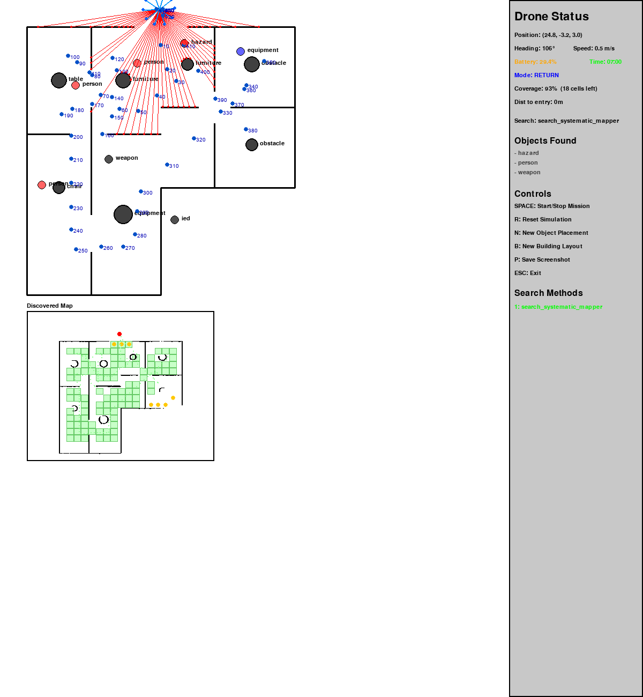

# Drone IED Search Simulation

An autonomous drone simulation system for searching unknown buildings to locate IEDs (Improvised Explosive Devices). The simulation models real drone hardware — ST 3D ToF LiDAR, OV2640 camera, STM32WL sub-GHz mesh radio, and 900 MHz long-range control link — so that simulation behavior accurately predicts real-world drone performance.



## Mission

Indoor search & rescue and hazard (IED-like) detection using a cooperative swarm. Each drone maps rooms, identifies people/objects with onboard AI, shares small map updates over mesh, and maintains a long-range pilot link.

## Mission Objectives

1. **Search an UNKNOWN building** - The drone has NO prior knowledge of the building layout
2. **Detect IEDs** - IED sensor has 3-meter range; must pass within 3m to detect
3. **Complete coverage** - Systematically cover all accessible areas
4. **Return safely** - Must return to start position before 7-minute time limit
5. **Don't get stuck** - Navigate around obstacles without getting trapped

## Key Constraints

- **Building is completely unknown** - Only LiDAR and camera data reveal the layout
- **7-minute time limit** - Battery/mission constraint
- **3-meter IED detection range** - Requires close proximity scanning
- **Must return home** - All data is lost if drone doesn't return

## Real Hardware Electronics Stack (150 g class)

### System Architecture

| Processor | Role |
|-----------|------|
| **STM32H7** | Flight control, stabilization, navigation, motor control, failsafe |
| **STM32N6** | Camera + LiDAR processing, AI inference, object detection, semantic mapping |
| **STM32WL** | Sub-GHz mesh radio for building/tunnel drone-to-drone communication |
| **900 MHz long-range radio** | Pilot command, telemetry, emergency control link (RFD900x-class) |

**Data flow:** Camera + LiDAR -> STM32N6 -> detections/map updates -> STM32H7 -> mesh radio (STM32WL). STM32H7 also connects to the 900 MHz control radio for operator link and failsafe.

### Sensors

| Sensor | Part | Notes |
|--------|------|-------|
| **LiDAR** | ST 3D ToF 54x42 | 71 deg diagonal FoV, 9m range, depth grid |
| **Camera** | OV2640 | Low-weight JPEG camera for AI object detection |
| **IED Sensor** | (application-specific) | 3m detection range |

### Radios (two independent links)

| Radio | Part | Purpose |
|-------|------|---------|
| **Mesh radio** | STM32WL sub-GHz module | Drone-to-drone mesh inside buildings/tunnels |
| **Control radio** | 900 MHz long-range (RFD900x-class) | Pilot command, telemetry, emergency failsafe |

### Cost Estimates

| Phase | Per-drone electronics |
|-------|----------------------|
| Prototyping (dev boards) | ~$500-900 total |
| Early builds | ~$200-350 per drone |
| Production (1k+ units) | ~$100-180 per drone |

## Hardware-Matched Simulation

The simulation models the real sensors and radios so behavior translates directly to hardware.

### LiDAR — ST 3D ToF 54x42

| Parameter | Value |
|-----------|-------|
| Sensor | ST 3D ToF 54x42 depth grid |
| Horizontal FoV | 59 deg (derived from 71 deg diagonal, 54:42 aspect) |
| Horizontal resolution | 54 rays (one per column) |
| Max range | 9 meters |
| Scan behavior | Forward-facing cone; drone rotates periodically to build 360 deg awareness |

The simulation casts 54 rays across a 59 deg cone centered on the drone's heading. Every 5 simulated seconds the drone takes additional scans at rotated orientations to accumulate full-surround map data from the limited field of view.

### Camera — OV2640

The OV2640 JPEG camera feeds the STM32N6 for onboard AI inference. In simulation this is modelled by the vision system (`core/vision.py`) which detects people, equipment, hazards, and weapons within an 8m / 60 deg FoV cone.

### Mesh Radio — STM32WL Sub-GHz (or XBee 900 MHz)

The drone-to-drone mesh link is modelled after the STM32WL sub-GHz radio module. The simulation code uses the protocol name `xbee_900mhz` since early prototyping may use either an XBee 900 MHz module or the STM32WL — both operate in the same sub-GHz band with similar characteristics.

| Parameter | Simulated Value |
|-----------|----------------|
| Bandwidth | 12.5 KB/s (100 kbps) |
| Latency | 20-80 ms per hop |
| Packet loss | 1% (close range) to 15% (max range), distance-dependent |
| Max fragment size | 200 bytes |
| Priority queue | CRITICAL(1) > HIGH(2) > MEDIUM(3) > LOW(4) |
| Topology | Store-and-forward mesh with AODV-style multi-hop routing |

Messages exceeding 200 bytes must be pre-fragmented. The `CommProtocol.fragment_message()` method handles this. Bandwidth is tracked per rolling 1-second window.

### Control Radio — 900 MHz Long-Range

The pilot/operator link (RFD900x-class) provides command uplink, telemetry downlink, and emergency failsafe. This link is not yet modelled in the simulation — all operator interaction currently happens through the pygame GUI. Future work will simulate latency, range limits, and failsafe behavior for this link.

### Data Types over Mesh Radio

| Data Type | Priority | Typical Size |
|-----------|----------|--------------|
| Mission commands / emergency | CRITICAL | ~50-100 bytes |
| Hazard / IED detections | HIGH | ~100-500 bytes |
| Map updates (incremental) | MEDIUM | ~100-800 bytes |
| LiDAR keyframes (54x42 grid) | LOW | ~1-5 KB compressed |
| Drone pose | LOW | ~50-80 bytes |

## How It Works

### Search Strategy (3m Grid Coverage)
1. **LiDAR maps walls** - 54 rays across 59 deg FoV, 9m range; periodic rotation for 360 deg coverage
2. **Camera detects objects** - OV2640 feeds STM32N6 AI for person/hazard/IED identification
3. **Divide into 3m grid** - IED detector has 3m range, so 3m grid = full coverage
4. **Visit each grid cell** - Nearest unsearched cell first, with sweep optimisation
5. **Share via mesh** - Map updates broadcast to swarm over STM32WL mesh
6. **Return before time expires** - Distance-based timing with safety margin

### Single Drone Performance
- Achieves **90-95% coverage** in typical buildings
- Uses boustrophedon-style sweep patterns for efficiency
- Completes rooms before moving to new areas

### Multi-Drone Swarm Mode
- **1-12 drones** working together (press D to cycle)
- STM32WL / XBee 900 MHz mesh networking with gossip protocol for map sharing
- Distance-dependent packet loss and per-hop latency
- Coordinated frontier selection to avoid overlap
- Range-limited communication (adjustable with +/- keys)

## Installation

```bash
# Clone the repository
git clone https://github.com/jmrothberg/flight-planning.git
cd flight-planning

# Create virtual environment
python3 -m venv .venv
source .venv/bin/activate

# Install dependencies
pip install -r requirements.txt

# Run the simulation
python3 simulation_main.py
```

## Controls

| Key | Action |
|-----|--------|
| **SPACE** | Start/Stop Mission |
| **R** | Reset Simulation |
| **N** | New Object Placement (same building) |
| **B** | New Building Layout |
| **D** | Cycle Drone Count (1-12) |
| **+/-** | Adjust Communication Range |
| **P** | Save Screenshot |
| **ESC** | Exit |

## Project Structure

```
flight_planning/
├── simulation_main.py      # Main entry point - orchestrates all systems
├── algorithm_config.py     # Search algorithm selection
├── requirements.txt        # Python dependencies
├── README.md              # This file
├── Drone_sim_README.md    # Detailed technical documentation
│
├── core/                  # Portable to real hardware (maps to STM32N6 + STM32H7)
│   ├── drone.py           # Flight control, waypoint navigation, battery (STM32H7)
│   ├── slam.py            # Occupancy grid mapping, localization (STM32N6)
│   ├── navigation.py      # A* pathfinding, exploration planning (STM32H7)
│   ├── sensors.py         # IED detection (3m range)
│   ├── vision.py          # Object detection via OV2640 + AI (STM32N6)
│   ├── communication.py   # STM32WL/XBee mesh protocol, priority queue, fragmentation
│   ├── minimap.py         # Real-time discovered map tracking
│   ├── search_systematic_mapper.py  # Grid-based coverage algorithm (V11.6a)
│   ├── drone_manager.py   # Multi-drone orchestration (1-12 drones)
│   ├── mesh_network.py    # Sub-GHz mesh with distance-based packet loss
│   └── gossip_map.py      # Distributed map sharing via gossip protocol
│
├── simulation/            # Simulation-only (not for real hardware)
│   ├── environment.py     # Building layouts, ST 3D ToF LiDAR simulation
│   ├── graphics.py        # Pygame rendering, FoV cone visualisation
│   └── physics.py         # Drone flight dynamics, collisions
│
└── r_s_m_*.png           # Screenshot results showing coverage achieved
```

## Core Modules

### Search Algorithm (`core/search_systematic_mapper.py`)
The brain of the drone navigation (runs on STM32N6):
- **Grid-based coverage**: 3m cells match IED detector range
- **Frontier selection**: Picks nearest unsearched cell
- **Sweep preference**: Continues in same direction to reduce backtracking
- **Region completion**: Finishes rooms before moving on
- **Return timing**: Distance-based formula ensures safe return
- **Limited FoV aware**: Handles both dict (new ST ToF format) and list (legacy) LiDAR data

### LiDAR Sensor Simulation (`simulation/environment.py`)
Models the ST 3D ToF 54x42 LiDAR:
- 54 horizontal rays across 59 deg FoV centred on drone heading
- 9m max range
- Returns structured dict: `{ranges, start_angle, angle_step, hfov, num_rays}`

### SLAM System (`core/slam.py`)
Simultaneous Localization and Mapping (runs on STM32N6):
- Processes limited-FoV LiDAR data to build occupancy grid
- Accepts both new dict format and legacy list format
- Particle filter tuned for 54-ray scans

### Communication (`core/communication.py`)
Sub-GHz mesh radio simulation (models STM32WL or XBee 900 MHz):
- 12.5 KB/s bandwidth with rolling window tracking
- 200-byte fragment size with `fragment_message()` helper
- Priority queue: CRITICAL > HIGH > MEDIUM > LOW
- Compression methods for LiDAR keyframes, poses, detections, and map data

### Mesh Network (`core/mesh_network.py`)
Simulated sub-GHz mesh protocol:
- Distance-dependent packet loss (1-15%)
- Per-hop latency (20-80 ms)
- Message size estimation and fragment validation
- AODV-style multi-hop routing

### Multi-Drone Coordination (`core/drone_manager.py`, `core/gossip_map.py`)
For 1-12 drone swarm missions:
- Each drone maintains its own map
- Gossip protocol shares discoveries when in comm range
- Claimed targets prevent duplicate coverage
- 12 distinct drone colours for visualisation

## Display Panels

### Main View (Top Left)
- Building layout with walls
- Drone position and orientation
- LiDAR rays showing 59 deg sensor cone with FoV boundary lines
- IED detector range (blue circle)
- Detected objects labelled

### Discovered Map (Bottom Left)
- **Green squares**: Searched grid cells (IED-scanned)
- **Yellow dots**: Frontier cells (unexplored areas)
- **Blue labels**: Detected objects
- **Red "IED!"**: Detected explosives
- **Black lines**: Discovered walls

### Drone Status (Right Panel)
- Position, heading, speed
- Battery level and mission time
- Coverage percentage
- Search mode (SEARCH/RUSH/RETURN)
- Objects found

### Multi-Drone Panel (Bottom Right, when D>1)
- Drone count and comm range
- Active mesh links
- Global coverage percentage
- Per-drone status

## Algorithm Versions

| Version | Description | Coverage |
|---------|-------------|----------|
| V11.5h | Conservative return timing | 81% |
| V11.6 | Sweep patterns (had bugs) | 76% |
| **V11.6a** | Fixed entry oscillation, optimised timing | **93%+** |
| **V11.6a+hw** | Real hardware: ST ToF LiDAR (59 deg/9m) + sub-GHz mesh | TBD |

## Technical Details

### Return Timing Formula (V11.6a)
```
time_to_return = distance_to_exit / 1.2 + 70 seconds
```
- 1.2 m/s effective speed (accounts for obstacle navigation)
- 70 second safety margin
- Triggers return when `time_remaining < time_to_return`

### Grid Coverage Math
- IED detector range: 3m
- Grid cell size: 3m x 3m
- Visiting centre of each cell guarantees every point is within 3m
- Coverage % = (searched interior cells) / (discovered interior cells) x 100

### Periodic Rotation Scan
With only 59 deg FoV, a single scan covers ~16% of the surroundings. Every 5 simulated seconds the drone takes ~5 additional scans at rotated orientations, effectively building a 360 deg picture from accumulated limited-FoV sweeps.

### Sub-GHz Mesh Protocol
- Drones broadcast map updates when in comm range
- Data includes: searched cells, free cells, walls, features
- Distance-dependent packet loss: 1% at close range, up to 15% at max range
- Per-hop latency: 20-80 ms random
- Messages > 200 bytes must be pre-fragmented
- Version vectors prevent duplicate processing
- Multi-hop routing extends effective range

## Hardware Integration

The `core/` modules are designed for direct portability to real hardware:

| Simulation Module | Target Hardware | Integration Notes |
|-------------------|-----------------|-------------------|
| `environment.get_lidar_scan()` | ST 3D ToF 54x42 via STM32N6 | Same dict format `{ranges, start_angle, ...}` |
| `vision.py` | OV2640 camera via STM32N6 AI | Replace with STM32N6 inference output |
| `communication.py` / `mesh_network.py` | STM32WL sub-GHz module | Implement `MeshProtocolInterface` for STM32WL SPI/UART |
| `drone.py` / `navigation.py` | STM32H7 flight controller | Replace `physics.py` with real motor/IMU API |
| `sensors.py` | IED sensor hardware | Replace with actual sensor interface |
| (not yet simulated) | 900 MHz control radio (RFD900x) | Future: add pilot link, telemetry, failsafe simulation |

### Why This Architecture Works
- Flight controller (STM32H7) stays real-time and isolated
- AI and perception handled on STM32N6 (camera + LiDAR processing)
- Mesh radio (STM32WL) handles room-to-room drone communication
- Long-range 900 MHz radio ensures command and failsafe control
- Scales well from prototype to production

## License

MIT License - See LICENSE file for details.

## Contributing

Contributions welcome! Please read the technical documentation in `Drone_sim_README.md` before making changes.

Key guidelines:
- **Don't break single-drone mode** - It works well, test thoroughly
- **Multi-drone coordination is WIP** - Improvements welcome
- **Document version changes** - Update README and docstrings
- **LiDAR format**: All new code should handle the dict format from `get_lidar_scan()`
- **Radio**: Simulation code uses `xbee_900mhz` as the protocol name; real hardware may use STM32WL or XBee — both are sub-GHz with similar characteristics
